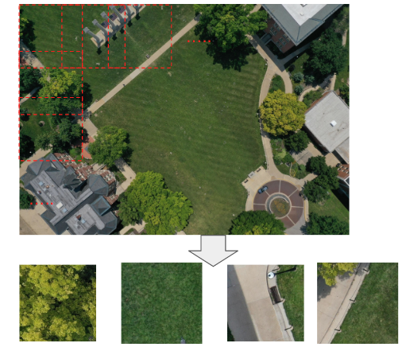

High Lights
=============================
As an end-to-end deep learning platform which focus on bird detectrion in RGB images, WaterfowlDetector has advantages on dealing with some specific problems when training and detecting small-bird objects in high resolution aerial images. These tricks can help you get better detecting performance without changing the network itself.

Datasets with high diversity
-------------------------------
With years of effort, we collect birds/decoys images from different resevation area in Missouri and make them into six datasets. These images are taken under different background, seasons, light conditions and bird density. Data diversity will cause great challenge to the models and make it robust to distinguish bird among many bird-like backgrounds. 

Prebuilt models 
------------------------
We provide six pretrained models based on six datasets we have. These model are trained with same hyperparameters but inference performance may vary. We also provide some general models which are trained by part or all of six datasets. Comparison of inference performance is welcome.    

Crop and merge
-------------------------

Because of the limitaion of GPU memory and computation, we crop high resolution images to low resolution ones when training and infering. The model will infer all low resolution images and merge the inference result to the high resolution ones. You don't need to worry about image size adjustment because we have done it for you!

