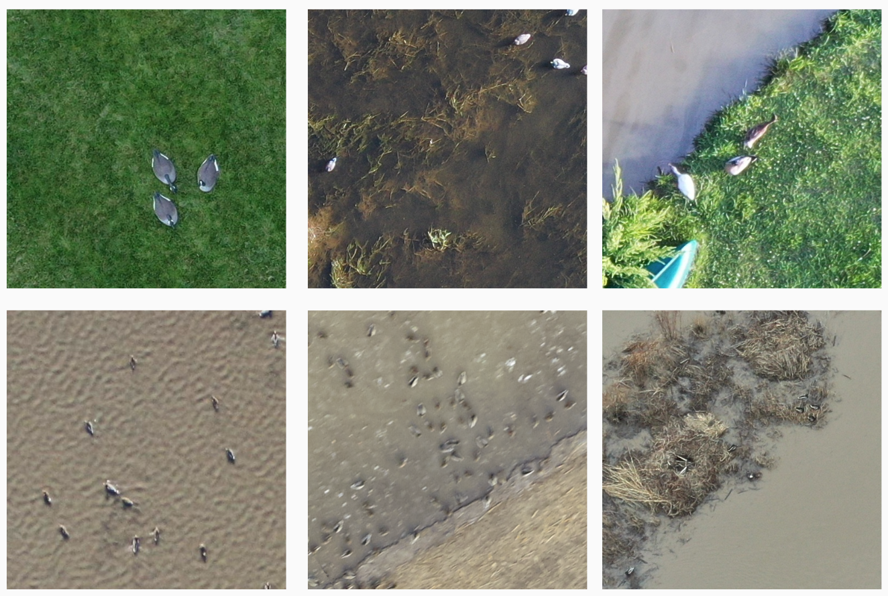

Datasets and Pretrained Models
==================================

Datasets
-------------------------------
We use a DJI Mavic Pro 2 to collect many aerial images of waterfowl in Missouri at different altitudes under different weather conditions. The table below provide examples of waterfowl of many colors, shapes, and sizes across many different habitat types in different weather conditions, all of which may affect the performance of deep learning models due to differences in the appearance of the waterfowl. Our datasets available here.

.. csv-table:: Datasets
   :header: "Datasets", "Location", "Number of images","sizes","Number of Birds","Altitude(m)","Season","Bird/Decoy"

   "Bird-A", "Mizzou", 162,"3584*5120",9010,"30-120","Spring","Decoys"
   "Bird-B", "Eagle Bluff", 36,"3648*5472",2175,"30-90","Fall","Decoys"
   "Bird-C", "A Pond", 104, "3648*5472",964,"30-90","Spring","Decoys"
   "Bird-D", "Illinois River", 339, "3840*5760",28837,"90","Winter","Birds"
   "Bird-E", "Grand Pass", 694, "512*512",79447,"90","Fall/Winter","Birds"
   "Bird-F", "Pershing park", 26, "3648*5472",1936,"30-60","Winter/Spring","Birds"

   Example images of six datasets

Pretrained models
-------------------------------
We also provide pretrained model for our six datasets from A to F. Also, we provide general models which are trained by part or all of six datasets. These Pretrained models available here. Download and unzip it into folder :file:`models`

.. csv-table:: Pretrained models
   :header: "Model name", "Training dataset","Inference dataset","Precision","Recall","F1-Score"

   "Fasterrcnn-A", "Bird-A", "Bird-A",0.823,0.893,0.857
   "Fasterrcnn-B", "Bird-B", "Bird-B",0.914,0.840,0.876
   "Fasterrcnn-C", "Bird-C", "Bird-C",0.540,0.896,0.674
   "Fasterrcnn-D", "Bird-D", "Bird-D",0.659,0.804,0.724
   "Fasterrcnn-E", "Bird-E", "Bird-E",0.998,0.818,0.899
   "Fasterrcnn-F", "Bird-F", "Bird-F",0.916,0.965,0.940
   "Fasterrcnn-high_density", "Bird-D,E","*","*","*","*"
   "Fasterrcnn-Bird", "Bird-D to F","*","*","*","*"
   "Fasterrcnn-Decoy", "Bird-A to C","*","*","*","*"
   "General_Model", "Bird-A to F","*","*","*","*"