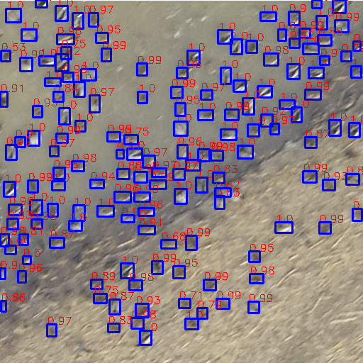

****************************
What is WaterfowlDetector?
****************************
WaterfowlDetector is a deep learning platform for training and predicting birds on aerial RGB images. We also includes six different datasets which contain manully labeled RGB images collected by our Mavic pro 2 drone from different conservation areas in Missouri. Based on `Detectron2 <https://github.com/facebookresearch/detectron2/>`_, a Facebook AI Research's next generation library, WaterfowlDetector include FasterRcnn models pretrained on these datasets. You can also train and predict your own bird datasets with custom models.

